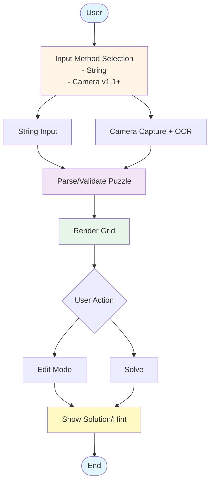
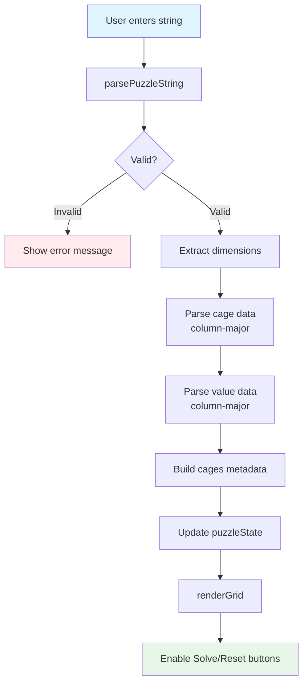
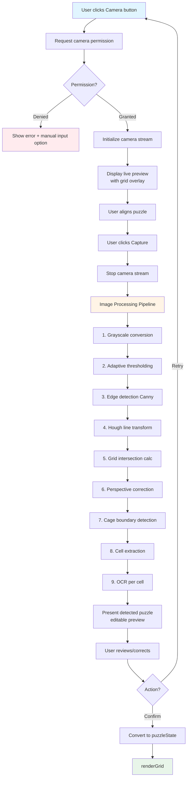
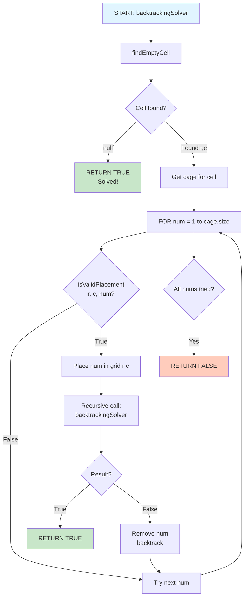
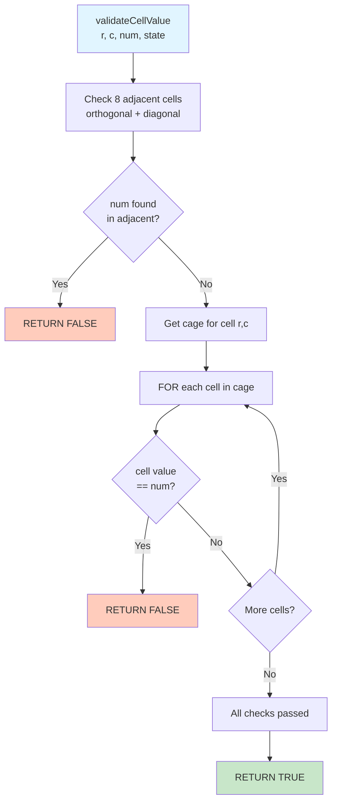
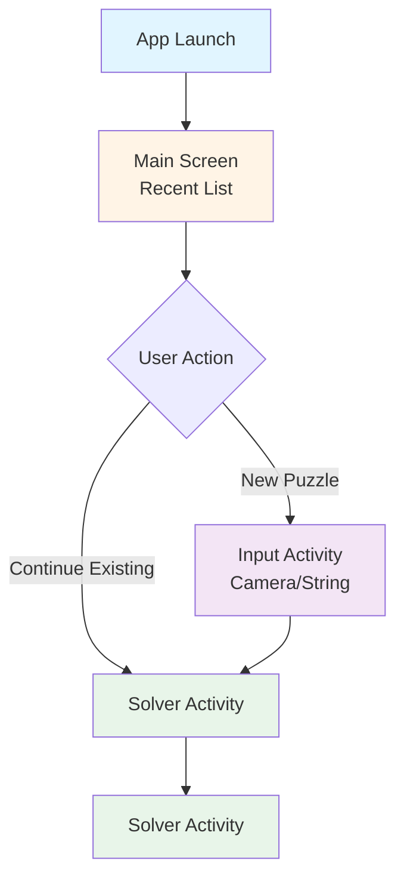

## 1. Flow Diagrams
### 1.1 Overall System Flow

---

### 1.2 String Input Flow (v1.0)

---

### 1.3 Camera Capture Flow (v1.1)

---

### 1.4 Solver Flow (Backtracking Algorithm)

---

### 1.5 Validation Flow

---

### 1.6 Android App Navigation Flow

---